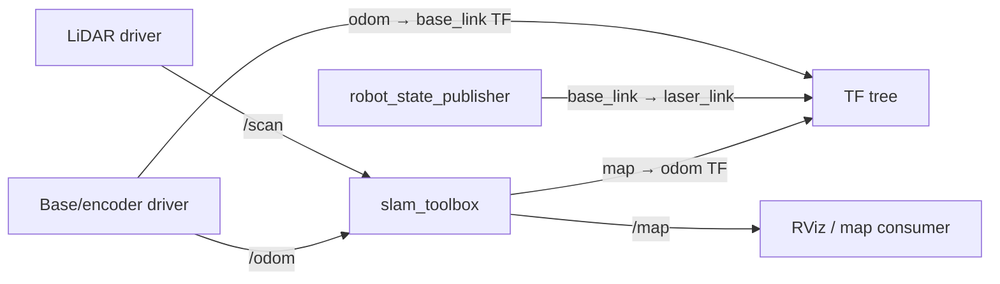

# SLAM Robot — ROS 2

[](https://github.com/vasu4990/slam-robot-ros2/actions/workflows/checks.yml)

A reusable ROS 2 package for a small differential-drive robot performing 2D LiDAR mapping with `slam_toolbox`.

> **Status:** ROS package/reference architecture complete; a real robot must still provide calibrated `/scan`, `/odom`, and the `odom → base_link` transform. Sensor drivers and base firmware are hardware-specific and intentionally not faked here.

The package is structured for a modern supported ROS 2 distribution and follows the standard `ament_python` package layout.

## Data flow



## Expected TF tree

```text
map
└── odom
    └── base_link
        ├── laser_link
        ├── left_wheel_link
        └── right_wheel_link
```

See [`docs/TF_TREE.md`](docs/TF_TREE.md).

## Requirements

Install ROS 2, `slam_toolbox`, `robot_state_publisher`, `xacro`, and your LiDAR/base drivers. In a workspace:

```bash
mkdir -p ~/slam_ws/src
cd ~/slam_ws/src
git clone https://github.com/vasu4990/slam-robot-ros2.git
cd ~/slam_ws
rosdep install --from-paths src --ignore-src -r -y
colcon build --symlink-install
source install/setup.bash
```

## Mapping

With the LiDAR and odometry drivers already publishing data:

```bash
ros2 launch slam_robot_ros2 mapping.launch.py
```

Useful overrides:

```bash
ros2 launch slam_robot_ros2 mapping.launch.py scan_topic:=/scan use_sim_time:=false rviz:=true
```

Before expecting a map, verify:

```bash
ros2 topic hz /scan
ros2 topic hz /odom
ros2 run tf2_ros tf2_echo odom base_link
ros2 run tf2_ros tf2_echo base_link laser_link
```

## Diagnostics node

The included diagnostics node monitors input rates:

```bash
ros2 run slam_robot_ros2 diagnostics
```

It is not a replacement for full robot diagnostics; it simply helps confirm that `/scan` and `/odom` are alive.

## Save a map

Once mapping is good, use the map-saving tools available in your ROS 2/Nav2 installation, or `slam_toolbox` serialization services when you need the pose graph for continued mapping/localization.

## Repository layout

```text
.
├── slam_robot_ros2/diagnostics.py
├── launch/
│   ├── mapping.launch.py
│   └── robot_state.launch.py
├── config/slam_toolbox.yaml
├── urdf/robot.urdf.xacro
├── docs/
│   ├── TF_TREE.md
│   ├── HARDWARE_BRINGUP.md
│   └── MAPPING_WORKFLOW.md
├── package.xml
├── setup.py
└── setup.cfg
```

## Hardware assumptions

The included URDF dimensions are placeholders for visualization/frame structure. Measure your chassis, wheel separation/radius, and LiDAR pose and update the robot model and base driver accordingly.

## License

MIT — see [`LICENSE`](LICENSE).
